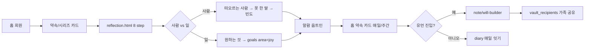
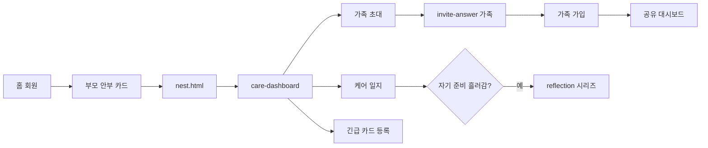
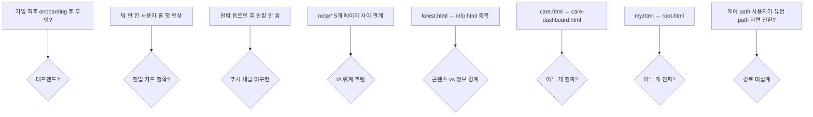

# 잇다 서비스 프레임워크 + 유저 플로우 — 비효율 진단

> 트리거: 사장님 발의 — *"지금 잇다의 서비스 프레임워크와 유저 플로우를 프레임워크로 그려줘. 유저 플로우워크 비효율 검토하고 서비스 정리하기 위함."*
> 참고 글: [Manyfast AI — UXUI 바이브 기획 도구](https://brunch.co.kr/@ghidesigner/455) (ghidesigner 브런치)
> 단일 원천: `nav.js` · `sw.js` APP_SHELL · HTML 인벤토리 · 결정 문서 (06-14 D1~D8, 06-15 L1~L8)
> 작성: 2026-06-15

---

## 0. 프레임워크 4축 (Manyfast 글에서 차용)

| 축 | 무엇 | 잇다 적용 |
| :-- | :-- | :-- |
| **PRD** | 제품 요구사항 (목적·페르소나·핵심 task) | §1 |
| **IA** | 정보 구조도 (Tree View — 페이지 위계) | §2 |
| **기능 명세** | 화면별 무엇을 하는가 | §3 |
| **User Flow** | 사용자 동선 (happy path + edge case) | §4 |

이 4축이 유기적 연결: PRD가 페르소나·task 정의 → IA가 페이지 위계 → 기능 명세가 화면 단위 → 유저 플로우가 화면 사이 이동. **하나가 어긋나면 비효율**.

---

## 1. PRD — 잇다 한 장

### 미션
**"잘 죽는 것은 잘 사는 것과 같다."** 죽음·돌봄·사별을 정면으로 다루며, 조용함·존엄의 톤으로 유언·자기성찰·가족 케어를 한 자리에 잇는다.

### 두 페르소나 (06-15 L3 (b) 한 코드 두 얼굴)

| 페르소나 | 진입 카피 | 핵심 task | 데이터 |
| :-- | :-- | :-- | :-- |
| **유언/웰니스** | "내일 다시 못 깨어난다면, 가장 후회할 일은?" | 자기성찰 시리즈 답 → 유언 작성 → 가족 공유 | `daily_questions`(reflection) · `daily_answers` · `note/will-builder` · `vault_recipients` |
| **케어링** | "부모님께 오늘, 안부 한 줄" | 부모 케어 일지 → 가족 협업 → 긴급 카드 | `care_dashboard` · `care_log` · `care_invite` · `care_emergency` |

### 공통 부모 (한 코드)
- 라이프(seed) · 콘텐츠(forest) · 마이(root) — 두 페르소나 공유
- 가입·로그인·디자인 시스템·헌장 — 단일

### 헌장 제약
- 과시·경쟁 0 · YMYL 단정 0 · 추모 보류 · 시니어 가독성 우선 · 디자인 토큰만

---

## 2. IA — Tree View

### 현재 상태 (2026-06-15)

```mermaid
graph TD
  Root[잇다 사이트]
  Root --> Public[비회원 진입]
  Root --> Auth[인증]
  Root --> App[5탭 앱 셸]
  Root --> Admin[어드민]

  Public --> About[about.html]
  Public --> Beta[beta.html]
  Public --> Ceremony[ceremony.html]
  Public --> Onboarding[onboarding.html]
  Public --> Index[index.html 비회원 분기]

  Auth --> Signup[signup.html]
  Auth --> Login[login.html]
  Auth --> Welcome[welcome.html]
  Auth --> Forgot[forgot.html]
  Auth --> Reset[reset.html]

  App --> Home[홈 - index.html]
  App --> Seed[라이프 - seed.html]
  App --> Nest[케어링 - nest.html]
  App --> Forest[콘텐츠 - forest.html]
  App --> RootTab[마이 - root.html]

  Home --> Ask[ask.html]
  Home --> Reflection[reflection.html]

  Seed --> Diary[diary-write/detail]
  Seed --> Plan[plan-write/detail]
  Seed --> NoteFolder[note/* 5개]
  NoteFolder --> WillBuilder[note/will-builder]
  NoteFolder --> Envelope[note/envelope]
  NoteFolder --> Digital[note/digital]
  NoteFolder --> Directive[note/directive-checklist]
  NoteFolder --> WillView[note/will]

  Nest --> Care[care.html ⚠️ legacy]
  Nest --> CareDash[care-dashboard.html]
  Nest --> CareEmer[care-emergency.html]
  Nest --> Invite[invite.html]
  Nest --> InviteAns[invite-answer.html]

  Forest --> InfoHub[info.html]
  Forest --> InfoFolder[info/* 7개]
  Forest --> ContentDet[content-detail/write]
  Forest --> PostDet[post-detail/write]
  Forest --> BookExp[book-export.html]

  RootTab --> My[my.html ⚠️ legacy]
  RootTab --> MySong[my-song.html]
  RootTab --> Setup[setup.html]
  RootTab --> Self[self.html]

  Admin --> AdminPage[admin.html]
```



### 인벤토리 — 50+ HTML 페이지
- 5탭 메인 5개 + 진입/인증 8개 + 라이프 하위 11개 + 케어링 하위 5개 + 콘텐츠 하위 11개 + 마이 하위 4개 + 어드민 1개 + **orphan(참조 0) 5개** = **50+**

### 비효율 신호
- 너무 많은 페이지 — 사장님 직관 "복잡함" 확인됨
- legacy active map 7개 매핑 (`care→nest`·`story→forest`·`my→root` 등) = UI는 옮겼는데 코드 잔재
- 같은 의미 페이지 중복 (아래 §5)

---

## 3. 기능 명세 — 화면 한 줄

### 살아있는 페이지 (38개)

**진입·인증 (8)**
| 페이지 | 기능 |
| :-- | :-- |
| `about.html` | 잇다 이야기·헌장 안내 |
| `beta.html` | 베타 안내·CTA |
| `ceremony.html` | 의례 입장 위저드 (퍼널 계측) |
| `onboarding.html` | 가입 직후 첫 안내 |
| `signup.html` | 회원가입 |
| `login.html` | 로그인 |
| `welcome.html` | 가입 직후 환영 |
| `forgot.html`·`reset.html` | 비번 찾기/재설정 |

**홈·자기성찰 (3)**
| 페이지 | 기능 |
| :-- | :-- |
| `index.html` | 회원 분기 (비회원 랜딩 / 회원 약속·진입 카드) |
| `ask.html` | 오늘의 질문 답 |
| `reflection.html` | 자기성찰 시리즈 (8 step, 06-14 D 결정) |

**라이프 (seed) 탭 (10)**
| 페이지 | 기능 |
| :-- | :-- |
| `seed.html` | 라이프 메인 (일기·약속 탭) |
| `diary-write.html`·`diary-detail.html` | 일기 작성·상세 |
| `plan-write.html`·`plan-detail.html` | 약속 작성·상세 |
| `note/will-builder.html` | 유언 빌더 (06-14 vault-will CORS 수정 계승) |
| `note/will.html` | 유언 상세 |
| `note/envelope.html` | 봉투 (유언 보관) |
| `note/digital.html` | 디지털 유산 (계정 정리) |
| `note/directive-checklist.html` | 사전연명의료 체크리스트 |

**케어링 (nest) 탭 (5)**
| 페이지 | 기능 |
| :-- | :-- |
| `nest.html` | 케어링 메인 |
| `care-dashboard.html` | 케어 대시보드 (가족 협업) |
| `care-emergency.html` | 긴급 카드 |
| `invite.html` | 가족 초대 |
| `invite-answer.html` | 초대받은 친구 진입 (06-14 답 + 가입 게이트) |

**콘텐츠 (forest) 탭 (8)**
| 페이지 | 기능 |
| :-- | :-- |
| `forest.html` | 콘텐츠 메인 (오늘잇고 큐레이션) |
| `info.html` | 정보 허브 (미리/곁에/떠난뒤) |
| `info/advance-directive.html` | 사전연명의료 안내 |
| `info/funeral-prepay.html` | 상조 안내 |
| `info/long-term-care.html`·`nursing-home.html` | 요양 안내 |
| `info/well-dying-guide.html` | 웰다잉 가이드 |
| `info/silver-town-guide.html`·`choosing-charnel-house.html` | 시니어/봉안 안내 |
| `content-detail.html`·`content-write.html` | 에세이 상세·작성 |
| `post-detail.html`·`post-write.html` | 포스트 상세·작성 |
| `book-export.html` | 책으로 내보내기 |

**마이 (root) 탭 (4)**
| 페이지 | 기능 |
| :-- | :-- |
| `root.html` | 마이 메인 |
| `my-song.html` | 나의 노래 |
| `setup.html` | 설정 |
| `self.html` | 자기 정보 |

**어드민 (1)**
| `admin.html` | 콘텐츠/사용자 관리 + 퍼널/콘텐츠 메트릭 |

### Orphan 페이지 (참조 0건, 5개)
- `story.html` · `stories.html` · `note.html` · `prototype-forest.html` · `footprint-preview.html`

### Legacy 의심 (살아있지만 정리 필요, 3개)
- `care.html` (admin·root에서만 참조 — `care-dashboard.html`로 대체 가능)
- `my.html` (admin에서만 참조 — `root.html`로 대체 가능)
- `questions.html` (ask.html에서만 참조 — 통합 가능)
- `write.html` (forest·content-detail·seed에서 참조 — 역할 모호)

---

## 4. User Flow — 핵심 동선

### 4.1 비회원 → 가입 (Happy Path)

```mermaid
flowchart LR
  Start([외부 유입]) --> Land{진입점}
  Land -->|랜딩| Index[index.html 비회원]
  Land -->|네이버 카페 답글| IndexUTM[index.html?utm_source=naver_cafe&p=will|care]
  Land -->|초대 링크| InviteAns[invite-answer.html]
  Land -->|콘텐츠 SEO| ContentDet[content-detail.html]

  Index --> Cards[진입 카드 2개]
  IndexUTM --> CardsHL[해당 path 카드 강조]
  Cards -->|유언/웰니스| ReflectionStart[reflection.html step1]
  Cards -->|케어링| NestStart[nest.html 또는 invite 흐름]

  ReflectionStart --> Signup[signup.html ← 답 정착]
  NestStart --> Signup
  InviteAns --> Signup

  Signup --> Welcome[welcome.html]
  Welcome --> Onboarding[onboarding.html]
  Onboarding --> Home[index.html 회원]
```

### 4.2 회원 첫 7일 — 유언/웰니스 path



### 4.3 회원 첫 7일 — 케어링 path



### 4.4 Edge Case (현재 끊김 지점)



---

## 5. 비효율 진단 — 10개

| # | 진단 | 증상 | 영향 | 우선순위 |
| :-- | :-- | :-- | :-- | :-- |
| **E1** | **Orphan 페이지 5개** (story·stories·note·prototype-forest·footprint-preview) | 어디서도 참조 안 됨, 검색·SW 캐시 낭비 | 빌드 무게·혼란 | 🔥 즉시 삭제 가능 |
| **E2** | **중복 페이지 3쌍** (care vs care-dashboard / my vs root / questions vs ask) | 동일 의미 두 페이지 공존, legacy active map 7개 | 유지보수 ↑, 신규 작업 시 어느 게 진짜인지 헷갈림 | 🔥 통합 결정 필요 |
| **E3** | **note/* 5개 페이지 위계 흐림** (will-builder / will / envelope / digital / directive-checklist) | 어디서 시작해서 어디로 가는지 모호 | 유언 path 첫 7일 끊김 | ⚠️ 트리 정리 필요 |
| **E4** | **forest ↔ info 경계 흐림** (콘텐츠 vs 정보) | 06-14에 nav 콘텐츠 탭 → forest로 옮긴 후에도 info.html이 남음 | 사용자 콘텐츠 발견 혼란 | ⚠️ 통합 검토 |
| **E5** | **알람 옵트인 후 실제 알람 없음** (06-14 사장님 제보) | "주 2회 알람 받고 싶다" 했는데 안 옴 | 약속 이행률 ↓, 신뢰 ↓ | 🔥 푸시 채널 결정 |
| **E6** | **두 path 사이 자연 전환 미설계** (L3 (b) 한 코드 두 얼굴 가정과 충돌) | 케어 → 유언 자연 전환 경로 없음, 마이에서 다른 path 활성화 카드 없음 | (b) 분리 결정 실효 ↓ | ⚠️ 진입 카드 작업과 함께 |
| **E7** | **비회원 첫 인상 = "약속 카드"** (회원용) | index.html이 비회원에 약속 카드 노출 | 첫 인상 부조화 | ⚠️ 진입 카드 작업과 함께 |
| **E8** | **가입 직후 데드엔드 가능성** | welcome → onboarding → 홈 흐름이 끊기는 시점 있음 | 첫 7일 retention ↓ | ⚠️ 동선 다이어그램으로 확인 |
| **E9** | **콘텐츠 탭 안 forest·info·content-detail·post-detail 4종 노출 분리 모호** | 같은 글이 어디로 분류? | 발견·재방문 ↓ | ⚠️ 콘텐츠 분류 결정 |
| **E10** | **5탭 + 진입 카드 + 서브 페이지 = 너무 깊은 구조** | 시니어 가독성 헌장과 충돌 | 첫 30초 이탈 | ⚠️ 깊이 1단계 줄이기 |

---

## 6. 정리안 — (b) 한 코드 두 얼굴과 연동

### 6.1 즉시 — 무손실 정리 (🔥, 다음 PE 라운드)

| 액션 | 파일 | 검증 | 위험 |
| :-- | :-- | :-- | :-- |
| **삭제** | `story.html` · `stories.html` · `note.html` · `prototype-forest.html` · `footprint-preview.html` | 참조 0건 확인됨 | 0 (orphan) |
| **삭제** | `care.html` → `care-dashboard.html`로 통일 | admin·root 참조만 갱신 | 매우 낮음 |
| **삭제** | `my.html` → `root.html`로 통일 | admin 참조만 갱신 | 매우 낮음 |
| **통합** | `questions.html` 기능을 `ask.html`로 흡수 | ask.html에서 참조 | 낮음 |
| **legacy active map 7개 정리** | nav.js에서 매핑 제거, 직접 키 사용 | 검색 후 갱신 | 낮음 |
| **sw.js APP_SHELL 정리** | 위 삭제 파일 제거 + CACHE_VERSION 갱신 | 자동 | 0 |

→ 효과: **HTML 50+ → 38개**, sw.js APP_SHELL 5줄 감소, legacy 매핑 정리.

### 6.2 다음 — IA 깊이 줄이기 (⚠️, L3·L4 결정 적용 라운드)

| 액션 | 결정 input |
| :-- | :-- |
| **index.html 진입 카드 2개** (유언·케어링) — 비회원·회원 분기 명확 | L3 `two-faces-one-code-2026-06-15.md` |
| **note/* 5개 → 라이프 탭에 단일 진입 카드** ("유언 시작하기") + 내부 단계 (작성→봉투→공유) | E3 진단 |
| **forest ↔ info 통합** — 콘텐츠 탭 1탭 (info는 사라지거나 forest 안 세그먼트) | E4·E9 진단 |
| **마이 탭에 "다른 path 활성화 카드"** — 케어 활성 사용자가 유언 시작 / 유언 활성 사용자가 케어 시작 | E6 진단, L3 자연 전환 |
| **비회원 index.html 완전 분리** — 회원 약속 카드 미노출, 헌장 한 줄 + 진입 카드 2개만 | E7 진단 |

### 6.3 결정·승인 필요 (사장님, ⚠️)

| 결정 | 옵션 | 추천 |
| :-- | :-- | :-- |
| **푸시 채널** (E5) | (a) Web Push (FCM/OneSignal) (b) 이메일 (c) 카톡 알림톡 | (b) 이메일 — 첫 7일 신뢰·시니어 적합. (a) Web Push 후속 |
| **유언 빌더 진입 위치** (E3) | (a) 라이프 탭 내부 (b) 홈 진입 카드 1번에서 직행 | (a) — 라이프 시리즈 답 → 유언으로 흐름 자연 |
| **콘텐츠 vs 정보** (E4) | (a) forest 단일 (b) info 단일 (c) 둘 다 유지 | (a) forest 단일 — 06-14 결정 일관 |
| **케어 → 유언 자연 전환 트리거** (E6) | (a) 라이프 시리즈 도달 시 자연 노출 (b) 명시적 카드 (c) 안 함 | (a) 자연 — 헌장 "시스템이 권하지 않음" 일관 |

### 6.4 의도적으로 안 하는 것

- ❌ 새 페이지 추가 (현재 50+에 더하지 않음)
- ❌ 신규 테이블·컬럼 추가 (L3 결정대로 entry_path 1개만)
- ❌ 디자인 토큰 변경 (헌장)
- ❌ 헌장 위배 경쟁·과시 요소

---

## 7. PE 위임 범위 (다음 라운드)

### 즉시 (무손실)
1. **Orphan 5개 + 중복 3쌍 삭제·통합** — 위 §6.1 표
2. **sw.js APP_SHELL 갱신 + CACHE_VERSION**
3. **legacy active map 정리** — nav.js

### 후속 (L3·L4 적용)
4. **index.html 두 진입 카드** — `two-faces-one-code-2026-06-15.md` §3·§4
5. **마이그레이션** `20260615_profiles_entry_path.sql`
6. **note/* IA 단순화** — 라이프 안 단일 진입 카드

### 결정 후 (사장님 승인)
7. **푸시 채널 구현** — 사장님 결정 후 (이메일 1차 추천)

---

## 8. 사장님 다음 행동 (이 문서 외부)

1. **§6.3 결정 4개 답** — 푸시 채널 / 유언 빌더 위치 / 콘텐츠·정보 / 자연 전환
2. **§6.1 무손실 정리 즉시 승인** — orphan 5개 + 중복 3쌍 = PE 자동 진행
3. **§6.2 IA 깊이 줄이기 시점** — 진입 카드 작업과 함께? 별도 라운드?

---

## 9. 이 문서가 닿을 후속 문서

- `docs/strategy/two-faces-one-code-2026-06-15.md` — (b) 분리 구체화 (이 문서와 짝)
- `docs/strategy/dashboard-redesign-2026-06-15.md` — L7 데이터 대시보드 (다음 세션)
- `docs/strategy/ux-benchmark-strategy-2026-06-15.md` — L8 UX 벤치마킹 (다음 세션)
- (PE 라운드 결과물) `index.html` 진입 카드 + sw.js + 마이그레이션 + IA 정리

---

## 부록 A. 헌장 일관성 확인

- ✅ 과시·경쟁 0 — 모든 정리 액션은 단순화, 카운터·뱃지 추가 0
- ✅ YMYL — 유언 빌더 위치 결정 시 법적 효력 단정 X 유지 (06-14 vault-will 수정 계승)
- ✅ 추모 보류 — 본 정리에서 추모(memorial) 노출 X
- ✅ 시니어 가독성 — 깊이 줄이기·페이지 통합이 목적
- ✅ 디자인 토큰 — 임의 hex 0
- ✅ 되돌리기 어려운 행동 — 페이지 삭제는 사장님 승인 (§8)

---

## 부록 B. Manyfast 4축 → 잇다 4축 한 줄 매핑

| Manyfast | 잇다 (이 문서) |
| :-- | :-- |
| PRD | §1 (미션·페르소나·task) |
| IA | §2 (Tree View + 인벤토리) |
| 기능 명세 | §3 (페이지별 한 줄 + 살아있음/orphan 분류) |
| User Flow | §4 (4개 플로우 + edge case 노드) |

추가로 잇다 특수:
- §5 비효율 진단 — 사장님 의도 핵심
- §6 정리안 — 결정 input
- §7 PE 위임 — 단일 원천 다음 라운드
